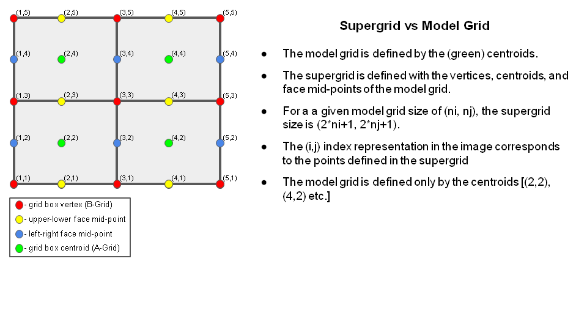

.. _ufs_utils:

****************************
Introduction
****************************

The Unified Forecast Systems (UFS) Utilities repository contains pre-processing programs for the UFS weather model.  These programs set up the model grid and create coldstart initial conditions. The repository is hosted on `Github <https://github.com/ufs-community/UFS_UTILS>`_.  Information on checking out the code and making changes to it is available on the repository `wiki page <https://github.com/ufs-community/UFS_UTILS/wiki>`_.

***********************************
Grid Generation
***********************************

The following programs are used to create a grid.

      * make_hgrid
      * regional_esg_grid
      * make_solo_mosaic
      * orog
      * orog_gsl (optional)
      * inland (optional)
      * lakefrac (optional)
      * global_equiv_resol
      * shave
      * filter_topo
      * sfc_climo_gen

The grid generation process is run by these scripts (located under ./ush)

      * fv3gfs_grid_driver.sh  (driver script)
      * fv3gfs_make_grid.sh (creates the geo-referencing for the grid)
      * fv3gfs_make_orog.sh (creates the land-sea mask, terrain and EMC gravity wave drag fields)
      * fv3gfs_make_orog_gsl.sh (creates GSL gravity wave drag fields)
      * fv3gfs_make_lake.sh (adds lakes and lake depth. optional)
      * fv3gfs_filter_topo.sh (filters the orography) 
      * sfc_climo_gen.sh (creates climatological surface fields, such as soil type)

***************************************************
Description of each program
***************************************************

chgres_cube
===========

.. include:: chgres_cube.rst

make_hgrid
==========

Introduction
------------

The make_hgrid program computes geo-referencing parameters for global uniform grids.  (Extended Schmidt gnomonic regional grids are created by the regional_esg_grid program.)  The parameters include geographic latitude and longitude, and grid cell area.  See the output data section for a full list of parameters.  Grids are gnomonic such that all great circles are straight lines.  The parameters are computed on the staggered or "supergrid" - which has twice the resolution of the model grid.  The chgres_cube initialization program maps mass fields - such as temperature - at the supergrid centroids, and u/v winds at the face mid-points.  The supergrid is shown here:

.. _figure_reference:

Code Structure
--------------

Location of source code: ./sorc/fre-nctools.fd/tools/make_hgrid.  Relevant routines:

      * make_hgrid.c - main driver routine
      * create_gnomonic_cubic_grid.c - contains routines for creating a gnomonic grid

Namelist Options
----------------

The program is controlled by these script variables:

      * Global uniform grid
             * res - x/y dimension of one tile.  The "CRES" resolution.  Example: a 96x96 tile would be classified as C96.  It may be converted to physical resolution as follows: resol = (360 degrees / 4*CRES) * 111 km. 

Program inputs and outputs
--------------------------

**Input data:**

None

**Output data:**

Tiled "grid" files (NetCDF) containing geo-referencing records.  File naming convention: CRES_grid.tile#.nc. File records include:

      * x - geographic longitude (degrees)
      * y - geographic latitude (degrees)
      * dx - grid edge 'x' distance (m)
      * dy - grid edge 'y' distance (m)
      * area - grid cell area (m^2)
      * angle_dx - grid vertex 'x' angle with respect to geographic east (degrees)
      * angle_dy - grid vertex 'y' angle with respect to geographic north (degrees)

regional_esg_grid
=================

Introduction
------------

The regional_esg_grid program computes geo-referencing parameters for the Extended Schmidt Gnomonic (ESG) regional grid.  The parameters include geographic latitude and longitude, and grid cell area.  See the output data section for a full list of parameters.  The ESG grid is designed to have nearly homogenous grid spacing.  Like the make_hgrid program, the parameters are computed on the staggered or "supergrid".  For more information on the Extended Schmidt Gnomonic, see: `Purser, et. al <https://dtcenter.org/sites/default/files/events/2020/2-purser-james.pdf>`_.

Code Structure
--------------

Location of source code: ./sorc/grid_tools.fd/regional_esg_grid.fd.  Relevant routines:

      * regional_esg_grid.f90 - Main driver routine.  Reads program namelist.  Writes output file.
      * pseg.f90 - Suite of routines to perform the ESG regional grid mapping.

Namelist Options
----------------

The program is controlled by these script variables:

      * target_lon - center longitude of grid - degrees
      * target_lat - center latitude of grid - degrees
      * idim - dimension of grid in 'i' direction
      * jdim - dimension of grid in 'j' direction
      * delx - grid spacing in degrees in the 'i' direction on the supergrid.  The physical grid spacing is related to delx as follows: 2*delx(circumf_earth / 360 deg).
      * dely - grid spacing in degrees in the 'j' direction on the supergrid.
      * halo - number of rows/cols of the lateral boundary halo

Program Inputs and Outputs
--------------------------

**Input data:**

None

**Output data:**

A tiled "grid" file (NetCDF) containing geo-referencing records for the supergrid.  File naming convention: CRES_grid.tile7.nc.  Here, CRES is the global equivalent resolution as computed by the global_equiv_resol program.  Note: the forecast model assumes regional grids are tile 1.  File records include:

      * x - geographic longitude (degrees)
      * y - geographic latitude (degrees)
      * dx - grid edge 'x' distance (m)
      * dy - grid edge 'y' distance (m)
      * area - grid cell area (m^2)
      * angle_dx - grid vertex 'x' angle with respect to geographic east (degrees)
      * angle_dy - grid vertex 'y' angle with respect to geographic north (degrees)

make_solo_mosaic
================

Introduction
------------

This program creates the "mosaic" file, which contains information about the tiled "grid" files (such as name and tile number).  For global grids, it also defines the orientation of the six tiles.  All output records are listed below under "output data".  There are no runtime-selectable options for this program.

Code structure
--------------

Location of source code ./sorc/fre-nctools.fd/tools/make_solo_mosaic.  Relevant routines:

      * make_solo_mosaic.c - main driver routine.
      * get_contact.c - computes the number of aligned contacts between two tiles.

Program inputs and outputs
--------------------------

**Input data:**  

The tiled "grid" files (CRES_grid.tile#.nc) created by the make_hgrid or regional_esg_grid programs - (NetCDF)

**Output data:** 

The mosaic file - CRES_mosaic.nc (NetCDF).  Contains these records

      * Mosaic - name of mosaic (character)
      * Gridlocation - directory containing the "grid" files (character)
      * Gridfiles - names of each "grid" file (character array)
      * Gridtiles - list of each tile number (character array)
      * Contacts - list of tile contact regions - global grids only (character array)
      * Contact_index - list of contact regions as specified by i/j index - global grids only (character array).

global_equiv_resol
==================

Introduction
------------

This program computes the global equivalent resolution for regional grids.  For example, a global grid with x/y dimensions of 96 would have a global resolution (CRES) of C96.  And the approximate physical resolution would be:

      * Res in km = (360 degrees / 4*CRES) * 111 km = 104 km 

Using the average cell size (in m^2) of the regional grid, the equivalent global resolution is computed according to:

      * CRES = nint( (2*pi*rad_earth)/(4*avg_cell_size) )

There are no runtime-selectable options for this program.

Code structure
--------------

Location of source code:  ./sorc/grid_tools.fd/global_equiv_resol.fd.  Relevant routine:

      * global_equiv_resol.f90 - Contains the entire program.

Program inputs and outputs
--------------------------

**Input data:**  

The regional "grid" file (CRES_grid.tile#.nc) created by the regional_esg_grid program - (NetCDF).  Uses the grid cell area record.

**Output data:**  

Adds the equivalent resolution as an attribute to the "grid" file - CRES_grid.tile#.nc  (NetCDF).

orog
====

Introduction
------------

This program computes the land mask, land fraction, orography and gravity wave drag (GWD) fields on the model grid.  See the output data section for a complete list of fields.

Land-sea mask and land fraction are created from a global 30-arc second University of Maryland land cover (land/non-land flag) dataset.  Land fraction is determined by averaging all 30-second land cover points located within the model grid box.   Points with a land fraction of 50% or more are given a land-sea mask of "land".  Orography and GWD fields are created from two datasets: 1) 30-arc-second `USGS GMTED2010 <https://www.usgs.gov/core-science-systems/eros/coastal-changes-and-impacts/gmted2010?qt-science_support_page_related_con=0#qt-science_support_page_related_con>`_ orography data; 2) for Antarctica, 30-arc-second `RAMP <https://nsidc.org/data/nsidc-0082>`_ terrain data (Radarsat Antarctic Mapping Project).  Fields are determined from all 30-arc second data located within the model grid box.  The orography is simply the average of the 30-arc second values.  It is later filtered by the filter_topo program.  For details on the GWD fields, see:

      * Kim, Y-J and A. Arakawa, 1995: Improvement of orographic gravity wave parameterization using a mesoscale gravity wave model.  J. Atmos. Sci. 52, pp 1875-1902.
      * Lott, F. and M. J. Miller: 1977: A new sub-grid scale orographic drag parameterization: Its formulation and testing, QJRMS, 123, pp 101-127.

**Caution:** At model grid resolutions of 1 km, the 30-arc-second input data will not be sufficient to properly resolve the land-sea mask, land fraction and orography fields. At model grid resolutions finer than 3 km, the remaining fields (used by the GWD) will not be well resolved. In that case, users should consider not running with GWD.

Code structure
--------------

The source code is located - ./sorc/orog_mask_tools.fd/orog.fd.  Some important subroutines:

      * MAKEMT2 - computes land fraction, land-sea mask, orography, standard deviation of orography, and convexity.  
      * MAKEPC2 - computes anisotropy (gamma), slope of orography (sigma) and mountain range angle (theta).
      * MAKEOA2 - computes maximum height (elvmax), orographic asymmetry (oa) and length scale (ol).

Program inputs and outputs
--------------------------

**Input data:**

      * The "grid" files (CRES_grid.tile#.nc) containing the geo-reference records for the grid - (NetCDF).  Created by the make_hgrid or regional_esg_grid programs.
      * Global 30-arc-second University of Maryland land cover data.  Used to create the land-sea mask.
             * landcover.umd.30s.nc (NetCDF). Located here `./fix/fix_orog <https://noaa-ufs-srw-pds.s3.amazonaws.com/index.html#fix/fix_orog/>`_.
      * Global 30-arc-second USGS GMTED2010 orography data.
             * topography.gmted2010.30s.nc (NetCDF). Located here `./fix/fix_orog <https://noaa-ufs-srw-pds.s3.amazonaws.com/index.html#fix/fix_orog/>`_.
      * 30-arc-second RAMP Antarctic terrain data (Radarsat Antarctic Mapping Project)
             * topography.antarctica.ramp.30s.nc (NetCDF). Located here `./fix/fix_orog <https://noaa-ufs-srw-pds.s3.amazonaws.com/index.html#fix/fix_orog/>`_.

**Output data:**  

Orography files - one for each tile - oro.CRES.tile#.nc (NetCDF).  Contains these records:

      * geolon - longitude (degrees east)
      * geolat - latitude (degrees north)
      * slmsk - land-sea mask (0 - nonland; 1 - land)
      * land_frac - land fraction (percent)
      * orog_raw - orography (meters)
      * orog_filt - same as orog_raw
      * stddev - standard deviation of orography (meters) 
      * convexity - orographic convexity (unitless)
      * oa[1-4] - orographic asymmetry - four directional components - W/S/SW/NW
      * ol[1-4] - orographic length scale - four directional components - W/S/SW/NW
      * theta - angle of mountain range with respect to east (degrees)
      * gamma - anisotropy (unitless)
      * sigma - slope of orography (unitless)
      * elvmax - maximum height above mean (meters)

orog_gsl
========

Introduction
------------

This program computes orographics statistics fields required for the orographic drag suite developed by NOAA's Global Systems Laboratory (GSL). The fields are a subset of the ones calculated by "orog" and are calculated in a different manner.

Code structure
--------------

Location of source code: ./sorc/orog_mask_tools.fd/orog_gsl.fd.

Program inputs and outputs
--------------------------

The program reads the tile number (1-6 for global, 7 for stand-alone regional) and grid resolution (e.g., 768) from standard input.

**Input data:**

All in NetCDF.

      * The tiled "grid" files (CRES_grid.tile#.nc) created by the make_hgrid or regional_esg_grid programs.
      * geo_em.d01.lat-lon.2.5m.HGT_M.nc - global topographic data on 2.5-minute lat-lon grid (interpolated from GMTED2010 30-second topographic data). `Located here <https://noaa-ufs-srw-pds.s3.amazonaws.com/index.html#fix/fix_am/>`_.
      * HGT.Beljaars_filtered.lat-lon.30s_res.nc - global topographic data on 30-second lat-lon grid (GMTED2010 data smoothed according to Beljaars et al. (QJRMS, 2004)). `Located here <https://noaa-ufs-srw-pds.s3.amazonaws.com/index.html#fix/fix_am/>`_.

**Output data:**

One for each tile. All in NetCDF.

      * CRES_oro_data_ls.tile#.nc - Large-scale file for the gravity wave drag and blocking schemes of `Kim and Doyle (2005) <https://doi.org/10.1256/qj.04.160>`_
      * CRES_oro_data.ss.tile#.nc - Small-scale file for the gravity wave drag scheme of `Tsiringakis et al. (2017) <https://doi.org/10.1002/qj.3021>`_. And the turbulent orographic from drag (TOFD) schemem of Beljaars et al. (QJRMS, 2004).

Each file contains the following records:

      * geolon - longitude (degrees east)
      * geolat - latitude (degrees north)
      * stddev - Standard deviation of subgrid topography
      * convexity - Convexity of subgrid topography
      * oa1 - Orographic asymmetry of subgrid topography - westerly
      * oa2 - Orographic asymmetry of subgrid topography - southerly
      * oa3 - Orographic asymmetry of subgrid topography - southwesterly
      * oa4 - Orographic asymmetry of subgrid topography - northwesterly
      * ol1 - Orographic effective length of subgrid topography - westerly
      * ol2 - Orographic effective length of subgrid topography - southerly
      * ol3 - Orographic effective length of subgrid topography - southwesterly
      * ol4 - Orographic effective length of subgrid topography - northwesterly

inland
======

Introduction
------------

This program reads an orography file, determines which points are inland from water, then writes out a mask record that identifies these points.

Code structure
--------------

Location of source code: ./sorc/orog_mask_tools.fd/inland.fd.

Program control options
-----------------------

The program reads the following parameters from standard input: 
      * The resolution. Ex: '96' for C96.
      * Nonland cutoff fraction. Default is '0.99'.
      * Maximum recursive depth. Default is '7'.
      * Grid type flag - 'g' for global, 'r' for regional.

Program inputs and outputs
--------------------------

**Input data:**

      * orography file - The orography file from the orog program - oro.CRES.tile#.nc (NetCDF)

**Output data:**

      * orography file - The input file, but containing an additional 'inland' record - '1' inland, '0' coastal.

lakefrac
========

Introduction
------------

This program sets freshwater lake fraction and lake depth on the model grid.

Code structure
--------------

Location of source code: ./sorc/orog_mask_tools.fd/lake.fd.

Program control options
-----------------------

The program reads the following parameters from standard input: 
      * The tile number.
      * The resolution. Ex: '96' for C96.
      * The path to the global lake data.
      * Minimum lake fraction in percent.

Program inputs and outputs
--------------------------

**Input data:**

      * grid file - the "grid" file from the make_hgrid or regional_esg programs  - CRES_grid.tile#.nc - (NetCDF)
      * orography file - the orography file including the 'inland' flag record from the inland program - oro.CRES.tile#.nc (NetCDF)
      * lake status code file - One of the following files. (located in `./fix/fix_orog <https://noaa-ufs-srw-pds.s3.amazonaws.com/index.html#fix/fix_orog/>`_). See GlobalLakeStatus.txt for a description of the file format.
          * GlobalLakeStatus_MOSISp.dat
          * GlobalLakeStatus_GLDBv3release.dat
          * GlobalLakeStatus_VIIRS.dat
      * lake depth file - One of the following files. (located in `./fix/fix_orog <https://noaa-ufs-srw-pds.s3.amazonaws.com/index.html#fix/fix_orog/>`_). See GlobalLakeDepth.txt for a description of this file.
          * GlobalLakeDepth_GLDBv3release.dat
          * GlobalLakeDepth_GLOBathy.dat

**Output data:**

      * orography file - the orography file including records of lake fraction and lake depth - oro.CRES.tile#.nc (NetCDF)

filter_topo
===========

Introduction
------------

The FV3 terrain filtering algorithm has several unique properties compared to conventional topography filters. The resulting topography filtered by this algorithm has conserved globally integrated elevations. More importantly, this filter has the following island-preserving properties: 1) No Gibbs ringing at the coastlines where discontinuities occur; 2) the filtered terrain's coastlines strictly match the source terrain's. The detailed implementation of this terrain filtering algorithm will be described in a forthcoming publication by Dr. Shian-Jiann Lin and his group.

Code structure
--------------

Location of source code: ./sorc/grid_tools.fd/filter_topo.fd. The entire program is contained in filter_topo.F90.

Namelist options
----------------

Program execution is controlled via a namelist.  The namelist variables are:

      * topo_file - Name of the orography file (See input data) (character)
      * topo_field - Name of the filtered orography record in the orography file ("orog_filt") (character)
      * mask_field - Name of the land-sea mask record in the orography file ("land_frac") (character)
      * grid_file - The mosaic file (See input data) (character)
      * zero_ocean - Flag to turn on the "island-preserving" property.  Default is true (logical)
      * stretch_fac - Stretching factor.  Equal to "1" for global uniform grids. Not applicable for ESG regional grids (floating point)
      * res - The "CRES" resolution (floating point)
      * grid_type - 0 for a gnomonic grid (integer)
      * regional - True for an ESG regional grid (logical)

Program inputs and outputs
--------------------------

**Input data:**

      * mosaic file - the mosaic file from the make_solo_mosaic program - CRES_mosaic.nc (NetCDF)
      * grid file - the "grid" file from the make_hgrid or regional_esg programs  - CRES_grid.tile#.nc - (NetCDF)
      * orography file - the orography file from the orog program - oro.CRES.tile#.nc (NetCDF)

**Output data:**

      * The filtered orography is written to the "orog_filt" record of the input orography file - oro.CRES.tile#.nc (NetCDF).

Filtering parameters
--------------------

      * n_del2 - Second-order strong filtering coefficient.
      * n_del2_weak - Second-order weak filtering coefficient - used to more finely smooth the topography compared to the strong filter.
      * cd4 - dimensionless coefficient for delta-4 diffusion.
      * peak_fac - overshoot factor for the mountain peak
      * max_slope - maximum allowable terrain slope

shave
=====

Introduction
------------

The "grid" and "orography" files for regional grids are first created with rows and columns extending beyond the halo.  This is required for the topography filtering code to work correctly in the halo region.  After filtering, the shave program removes these extra points from the files.

Code structure
--------------

Location of the source code: ./sorc/grid_tools.fd/shave.fd.  The entire program is contained in shave_nc.F90.

Program control options
-----------------------

The program is controlled by these parameters read from standard input:

      * The i/j dimensions of the compute domain (not including halo) (integer)
      * The number of halo rows/columns (integer)
      * The file name with the extra points (character string)
      * The name of the output file with the extra points removed (character string)

Program inputs and outputs
--------------------------

**Input data:**

      * Model "grid" files (CRES_grid.tile#.nc) created by the make_hgrid or regional_esg_grid programs - (NetCDF)
      * Model orography files (oro.CRES.tile#.nc)  after topography filtering - (NetCDF)

**Output data:** 

With and without the halo.

      * Model "grid" files - CRES.grid.tile#.halo#.nc (NetCDF) 
      * Model orography files - CRES.oro_data.tile#.halo#.nc (NetCDF)

sfc_climo_gen
=============

Introduction
------------

The sfc_climo_gen (surface climatological field generation) program creates surface climatological fields such as soil type, vegetation type and albedo.  Some fields may be time-varying: for example, snow-free albedo is monthly.  But they are static - i.e., they only need to be generated when the grid is created.  The program uses the ESMF library to horizontally interpolate the source data to the model grid.  For regional grids, the program will output files with and without the halo region when the "halo" namelist variable is set.

Code structure
--------------

Location of the source code: ./sorc/sfc_climo_gen.fd.  Brief description of each module:

      * driver.F90 - The main driver routine.
      * interp.F90 - The interpolation driver routine.  Reads the input source data and interpolates it to the model grid.
      * interp_frac_cats.F90 - Same as interp.F90, but for computing the fraction of each soil and vegetation type category. (When namelist variable 'vegsoilt_frac' is true).
      * model_grid.F90 - Defines the ESMF grid object for the model grid.
      * output.f90 - Writes the output surface data to a NetCDF file.  For regional grids, will output separate files with and without the halo.
      * output_frac_cats.f90 - Same as output.f90, but for writing fractional soil and vegetation type. (When namelist variable 'vegsoilt_frac' is true).
      * program_setup.f90 - Reads the namelist and sets up program execution.
      * search.f90 - Replace undefined values on the model grid with a valid value at a nearby neighbor. Undefined values are typically associated with isolated islands where there is no source data.
      * search_frac_cats.f90 - Same as search.f90, but for the fractional soil and vegetation type option.  (When namelist variable 'vegsoilt_frac' is true).
      * source_grid.F90 - Reads the grid specifications and land/sea mask for the source data.  Sets up the ESMF grid object for the source grid.
      * utils.f90 - Contains error handling utility routines.

Namelist options
----------------

Program execution is controlled via a namelist.  The namelist variables are:

      * input_facsf_file - path/name of input fractional strong/weak zenith angle albedo data
      * input_substrate_file - path/name of input soil substrate temperature data
      * input_maximum_snow_albedo_file - path/name of input maximum snow albedo data
      * input_snowfree_albedo_file - path/name of input snow-free albedo data
      * input_slope_type_file - path/name of input global slope type data
      * input_soil_type_file - path/name of input soil type data
      * input_soil_color_file - path/name of input soil color data
      * input_vegetation_type_file - path/name of vegetation type data
      * input_vegetation_greenness_file - path/name of monthly vegetation greenness data
      * mosaic_file_mdl - path/name of the model mosaic file
      * orog_dir_mdl - directory containing the model orography files
      * orog_files_mdl - list of model orography files.  For global uniform grids, all six files are listed.
      * halo - number of rows/cols of the lateral boundary halo (regional grids only).  When selected, the program will output files with and without the halo region.
      * maximum_snow_albedo_method - interpolation method for this field.  Bilinear or conservative.  Default is bilinear.
      * snowfree_albedo_method -  interpolation method for this field.  Bilinear or conservative.  Default is bilinear.
      * vegetation_greenness_method -  interpolation method for this field.  Bilinear or conservative.  Default is bilinear.
      * vegsoilt_frac - When 'true', outputs the dominate soil and vegetation type, and the fraction of each category. When 'false', only outputs the dominate categories. Default is 'false'.

Program inputs and outputs
--------------------------

**Input data:** 

The surface climatological data is located here `./fix/fix_sfc_climo <https://noaa-ufs-srw-pds.s3.amazonaws.com/index.html#fix/fix_sfc_climo/>`_.  All NetCDF.

      * Global 1-degree fractional coverage strong/weak zenith angle albedo - facsf.1.0.nc
      * Global 0.05-degree maximum snow albedo - maximum_snow_albedo.0.05.nc
      * Global 0.5-degree soil substrate temperature - substrate_temperature.gfs.0.5.nc
      * Global 0.05-degree four component monthly snow-free albedo - snowfree_albedo.4comp.0.05.nc
      * Global 1.0-degree categorical slope type - slope_type.1.0.nc
      * Global 0.05-degree CLM soil color (Lawrence and Chase, 2007 JGR) - soil_color.clm.0.05.nc
      * Categorical STATSGO soil type
             * Global 0.05-degree - soil_type.statsgo.0.05.nc
             * Global 0.03-degree - soil_type.statsgo.0.03.nc
             * CONUS 30 sec - soil_type.statsgo.conus.30s.nc
             * N Hemis 30 sec - soil_type.statsgo.nh.30s.nc
             * Global 30 sec - soil_type.statsgo.30s.nc
      * Categorical BNU soil type
             * Global 30-second - soil_type.bnu.v3.30s.nc
      * Categorical IGBP vegetation type
             * MODIS-based global 0.05-degree - vegetation_type.modis.igbp.0.05.nc
             * MODIS-based global 0.03-degree - vegetation_type.modis.igbp.0.03.nc
             * MODIS-based CONUS 30 sec - vegetation_type.modis.igbp.conus.30s.nc
             * MODIS-based N Hemis 30 sec - vegetation_type.modis.igbp.nh.30s.nc
             * MODIS-based global 30 sec - vegetation_type.modis.igbp.30s.nc
             * NESDIS VIIRS-based global 30-second - vegetation_type.viirs.v3.igbp.30s.nc
      * Global 0.144-degree monthly vegetation greenness in percent - vegetation_greenness.0.144.nc

The files that define the model grid. All NetCDF.

      * Model mosaic file - CRES_mosaic.nc
      * Model orography files including halo - CRES_oro_data.tile#.halo#.nc
      * Model grid files including halo - CRES_grid.tile#.halo#.nc

**Output files:** 

All files with and without halo (all NetCDF).

      * Fractional coverage strong/weak zenith angle albedo - CRES_facsf.tile#.halo#.nc
      * Maximum snow albedo - CRES_maximum_snow_albedo.tile#.halo#nc
      * Soil substrate temperature - CRES_substrate_temperature.tile#.halo#.nc
      * Snow free albedo - CRES_snowfree_albedo.tile#.halo#.nc
      * Slope type - CRES_slope_type.tile#.halo#.nc
      * Soil type - CRES_soil_type.tile#.halo#.nc
      * Soil color - CRES_soil_color.tile#.halo#.nc
      * Vegetation type - CRES_vegetation_type.tile#.halo#.nc
      * Vegetation greenness - CRES_vegetation_greenness.tile#.halo#.nc

vcoord_gen   
==========

Introduction
------------

This program generates hybrid coordinate parameters from fields such as surface pressure, model top and the number of vertical levels. Outputs the 'ak' and 'bk' parameters used by the forecast model and chgres_cube to define the hybrid levels as follows:

      * pressure = ak + (surface_pressure * bk)

Code structure
--------------

Location of the source code: ./sorc/vcoord_gen.fd.

Program inputs
--------------

The following user-defined parameters are read in from standard input.

     * levs - Integer number of levels
     * lupp - Integer number of levels below pupp
     * pbot - Real nominal surface pressure (Pa)
     * psig - Real nominal pressure where coordinate changes from pure sigma (Pa)
     * ppre - Real nominal pressure where coordinate changes from pure pressure (Pa)
     * pupp - Real nominal pressure where coordinate changes to upper atmospheric profile (Pa)
     * ptop - Real pressure at top (Pa)
     * dpbot - Real coordinate thickness at bottom (Pa)
     * dpsig - Real thickness of zone within which coordinate changes to pure sigma (Pa)
     * dppre - Real thickness of zone within which coordinate changes to pure pressure (Pa)
     * dpupp - Real coordinate thickness at pupp (Pa)
     * dptop - Real coordinate thickness at top (Pa)

Program outputs
---------------

A text file is output containing the 'ak' and 'bk' values. To use it in chgres_cube, set namelist variable "vcoord_target_grid" to the path/name of this file.

Run script
----------

To run, use script ./util/vcoord_gen/run.sh

weight_gen   
==========

Introduction
------------

Creates ESMF 'scrip' files for gaussian grids. 

Code structure
--------------

Location of the source code: ./sorc/weight_gen.fd.

Program inputs
--------------

The global FV3 grid resolution from standard output. Valid choices are:

     * C48
     * C96
     * C128
     * C192
     * C384
     * C768
     * C1152
     * C3072

Program outputs
---------------

Two gaussian grid 'scrip' files in NetCDF format. One includes two extra rows for the poles.

     * C48  => 192x94 and 192x96 gaussian files
     * C96  => 384x192 and 384x194 gaussian files
     * C128 => 512x256 and 512x258 gaussian files
     * C192 => 768x384 and 768x386 gaussian files
     * C384 => 1536x768 and 1536x770 gaussian files
     * C768 => 3072x1536 and 3072x1538 gaussian files
     * C1152 => 4608x2304 and 4608x2406 gaussian files
     * C3072 => 12288x6144 and 12288x6146 gaussian files

Files contain center and corner point latitude and longitudes.

Run script
----------

To run, use the machine-dependent script under ./util/weight_gen

***************************************************
UFS_UTILS utilities
***************************************************

gdas_init
=========

Introduction
------------

The gdas_init utility is used to create coldstart initial conditions for global cycled and forecast-only experiments using the chgres_cube program.  It has two components: one that pulls the input data required by chgres_cube from HPSS, and one that runs chgres_cube. The utility is only supported on machines with access to HPSS:

     * Hera
     * Jet
     * WCOSS2
     * S4 (Only the chgres_cube step is supported, not the data pull step.)

Location
--------

Find it here: ./util/gdas_init

Build UFS_UTILS and set 'fixed' directories
-------------------------------------------

Invoke the build script from the root directory: 

::

  ./build_all.sh

Set the 'fixed' directories using the script in the './fix' subdirectory (where $MACHINE is 'hera', 'jet', 'wcoss2', or 's4'):

::

  ./link_fixdirs.sh emc $MACHINE

Configure for your experiment
-----------------------------

Edit the variables in the 'config' file for your experiment:

     * **EXTRACT_DIR**  - Directory where data extracted from HPSS is stored.
     * **EXTRACT_DATA** - Set to 'yes' to extract data from HPSS. If data has been extracted and is located in EXTRACT_DIR, set to 'no'. On 's4' this step can't be run. Instead, the data must be pulled from another machine.
     * **RUN_CHGRES**   - To run chgres, set to 'yes'.  To extract data only, set to 'no'.
     * **yy/mm/dd/hh**  - The year/month/day/hour of your desired experiment. Use two digits.  NOTE: The standard build of chgres_cube does NOT support pre-v14 or v15 input data (when CDUMP is 'gfs'). To use this data, contact a repository manager for assistance.
     * **LEVS**         - Number of hybrid levels plus 1.  To run with 127 levels, set LEVS to 128.
     * **CRES_HIRES**   - Resolution of the hires component of your experiment. Example: C768.
     * **CRES_ENKF**    - Resolution of the enkf component of the experiments.
     * **UFS_DIR**      - Location of your cloned UFS_UTILS repository.
     * **OUTDIR**       - Directory where the coldstart data output from chgres is stored.
     * **CDUMP**        - When 'gdas', will process gdas and enkf members. When 'gfs', will process gfs member for running free forecast only.
     * **use_v16retro** - When 'yes', use v16 retrospective parallel data. The retrospective parallel tarballs can be missing or incomplete. So this option may not always work. Contact a UFS_UTILS repository manager if you encounter problems.

Note: This utility selects the ocean resolution in the set_fixed_files.sh script using a default based on the user-selected CRES value. For example, for a cycled experiment with a CRES_HIRES/CRES_ENKF of C384/C192, the ocean resolution defaults to 0.25/0.50-degree. To choose another ocean resolution, the user will need to manually modify the set_fixed_files.sh script.

Kick off the utility
--------------------

Submit the driver script (where $MACHINE is 'hera', 'jet', 'wcoss2', or 's4')

::

  ./driver.$MACHINE.sh 

The standard output will be placed in log files in the current directory. 

The converted output will be found in $OUTDIR, including the needed abias and radstat initial condition files (if CDUMP=gdas). The files will be in the needed directory structure for the global-workflow system, therefore a user can move the contents of their $OUTDIR directly into their $ROTDIR.
